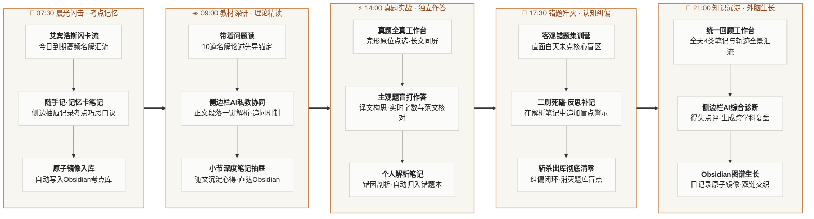

# YuReader

<p align="center">
  <strong>为硬核学习者构建的本地认知作战室 · Local Cognitive Operating Environment</strong>
</p>

<p align="center">
  <em>“读书不是在字里行间漫步，而是带着猎矛在文本丛林中精准突刺。”</em>
</p>

---

## ✦ 缘起：为什么我们厌倦了主流学习工具？

在现代学习场景中，每一个严肃学习者几乎都在经历一种**认知割裂的酷刑**：

- 在 PDF 阅读器里看教材，昏昏欲睡，读完三章脑中依然一片空白；
- 去刷题 App 里刷客观题，答案对了就滑过，做错了解析只有孤立的一两句话，与教材正文完全脱节；
- 打开笔记软件试图总结，变成了机械的“复制 - 粘贴 - 排版”，在知识管理软件里堆积了一堆从未真正内化过的“知识尸体”；
- 旁边放着番茄钟或手机计时器，动辄弹出的数字与震动不断制造焦虑，工具切换的摩擦力吞噬了大半心力。

**YuReader 的诞生，就是为了终结这种碎片化。**

它不是又一个平庸的 Electron 阅读器，也不是又一个套壳题库。它是一套**以书籍为本位、本地优先（Local-First）、严谨典雅的个人认知操作系统**。它将「通读教材」、「带着问题主动回忆」、「真题实战」、「即时错题攻坚」与「本地知识库镜像」熔铸为一体，让深阅读与硬核应试形成严密咬合的飞轮。

---

## ✦ 核心机制与精妙架构 (Core Architecture & Clever Craft)

抛开繁琐的技术参数，YuReader 真正让人上瘾的，是围绕**「高强度笔记沉淀」**与**「无处不在的双侧边栏协同」**构建的认知中枢：

### 1. 「上下文绑定的全维度原子笔记网络」：告别信息孤岛，直通 Obsidian 神经外脑
> *“笔记不该是剪贴板的简单搬运，而是在阅读正文、推导考点与实战解题时，大脑与文本碰撞出的火花。”*

- **四维情境笔记织网**：
  - **小节精读笔记（Section Notes）**：阅读教材时，右侧抽屉随手唤出，实时绑定当前章节稳定 ID，记录原书机理思考与逻辑框图；
  - **考点记忆随手记（Flashcard Mnemonics）**：在背诵名词解释与论述时，随手记弹窗记录自创口诀与串记线索，打通长效记忆通道；
  - **解题复盘个人解析（Question Analysis）**：做错题目时，不盲从原卷官方套话，而是在原题下方直接沉淀属于自己的陷阱剖析；
  - **主观题作答与反思（Subjective Reflection）**：翻译与大作文独立作答区，记录词句锤炼与框架得失。
- **Obsidian 实时双向呼吸**：
  - 所有笔记、解析、作答全部以极简 Markdown 格式原子级保存在本地 `data/`，并自动通过规范的 YAML Frontmatter 与深链接（`obsidian://open`）**双向镜像进你的 Obsidian Vault**。
  - 在阅读器里输入，在 Obsidian 里编织双链知识图谱，资产 100% 归你所有，数据永不丢失。

### 2. 「双翼中枢：左锚心流 · 右翼 AI Sidecar 私教协同」
> *“真正的专注不是把屏幕塞满，而是左手掌控全局，右手直通私教。”*

- **左侧静默控制台（The Command Sidebar）**：
  - 68px 极致窄化折叠，呼吸般轻盈。悬停即展开全学科导航（今日 / 学习库 / 回顾 / 记录 / 统计），点击即穿透到任何知识坐标。
  - **自适应任务指标微光环**：将当前任务完成度（阅读学时、错题斩杀、背诵进度）化为徽标同心细线，0 屏幕文字干扰，悬停知全貌。
- **右翼上下文抽屉（Contextual Dock）+ 侧边栏 AI 协同**：
  - 不遮挡正文的双栏/浮动抽屉，随时展开小节笔记、考点清单与错题解析；
  - **原生适配侧边栏 AI 私教（AI Sidecar Co-pilot）**：专为浏览器侧边栏大模型（Gemini / Claude）量身优化。正文与题目上下文高度结构化，提供一键格式化复制与专用提示词模板（“理解这道题 / 闭卷口述 / 按点批改”）。阅读器是严谨的客观事实基石，侧边栏 AI 是随时可以探讨反刍的苏格拉底。

### 3. 「带着问题读」：把教材直接变成靶场
- **章节考点自动映射**：系统内部建有一套章节知识图谱映射引擎，将 2,200+ 道高频考题（名解、论述、重点）高保真锚定回每一本官方教材的具体章节。
- **主动回忆（Active Recall）折叠设计**：点击顶部「带着问题读」，抽屉滑出本章考题。这里没有直接剧透的标准答案，只有星级和干文。先在大脑中检索回忆、带着考点研读正文，再展开对比核对——**阅读不再是被动的信息灌输，而是一场主动的侦察与验证**。

### 4. 「正文与题库的量子纠缠」：打破切屏地狱
- **完形填空的原位点选**：不再是“上面一段文章、下面翻来翻去找题”。YuReader 将 20 个空位直接无缝融合进正文段落，点击某空，下方仅浮现该空选项，沉浸感如在真实纸面批注。
- **长篇阅读的双栏工作台**：左侧完整原文、右侧全组试题。原文段落与题目选项同屏对照，提交前完全封锁答案解析防剧透；提交后直出原书解析与个人复盘区。
- **主观题盲打与双重对比**：翻译与作文工作台左侧展示材料，右侧提供独立作答区与实时字数提示。只有完成独立构思后，才允许展开权威参考译文与解析。

### 5. 「艾宾浩斯抗遗忘 + 错题斩杀营」
- **重点卡片无缝翻转**：名词解释与简答论述采用类 Anki 的极速卡片流（Flashcards），支持正反面翻转、遮挡填空（Cloze）与重点星标。
- **智能记忆间隔调度**：依据「完全遗忘 / 模糊犹豫 / 熟练掌握」自动排程复习周期。
- **错题二刷攻坚**：每一道做错的客观题都会自动收录进专属错题本，提供独立的“消灭错题”集训模式，直到将错题本彻底清零。

---

## ✦ 真实一日：硬核学习者的 24 小时认知飞轮 (A Day in the Life)

> *“最好的系统不是让你感觉‘在用工具’，而是让你在整日的自然心流中，不知不觉完成从知识输入、主动回忆、真题淬炼到外脑生长的全过程。”*

下面是 YuReader 如何贯穿并支撑一名硬核学习者全天真实学习的**全景认知看板**：



### 闭环流转详解：从晨光到深夜的认知闭环

1. **🌅 07:30 · 晨起唤醒与考点记忆**
   - **告别盲目找题**：清晨起床，打开首页，不必思考“今天该背什么”。系统基于艾宾浩斯记忆模型已自动汇聚今日到期的专科核心考点。
   - **闪卡极速过关 + 记忆卡随手记**：翻转卡片流进行主动回忆（Active Recall）；右侧呼出随手记弹窗写下自创的谐音/逻辑口诀，系统自动将口诀与考点绑定，原子级写入本地并同步至 Obsidian 考点库。

2. **☀️ 09:00 · 深度研读与理论精读**
   - **教材即靶场**：翻开厚重的《牙体牙髓病学》，拒绝催眠式的“从头读到尾”。呼出「带着问题读」考点抽屉，10 道高频名解与论述大题先入为主，在脑海中建立侦察地图。
   - **右侧小节深度笔记抽屉**：沉浸研读正文时，右侧抽屉随时呼出记录机制推演心得。点击右上角 `obsidian://open` 即可直接在 Obsidian 里唤醒该小节独立双链笔记。
   - **侧边栏 AI 私教协同**：读到疑难段落，点击一键格式化复制，扔给右侧浏览器侧边栏 AI 私教（Gemini / Claude），进行临床案例延伸追问与即时答疑。

3. **⚡ 14:00 · 真题实战与个人解析**
   - **告别切屏地狱**：下午进入真题实战。进入 2024 考研英语工作台，完形填空在正文段落中原位点击空格作答；长篇阅读左文右题同屏呈现；主观题盲打比对范文。
   - **原题下方沉淀个人解析笔记**：做错题目时，不盲信官方生硬解析，直接在题下撰写属于自己的陷阱剖析笔记；做错题目由系统自动捕获并截流进专属错题本。

4. **🎯 17:30 · 错题歼灭与反思补记**
   - **傍晚攻坚战**：在一天精力有所回落的傍晚，不再进行大块新内容输入，而是聚焦攻坚。首页「错题攻坚」徽章提示“剩余 5 题待消灭”。
   - **二刷死磕与笔记追加**：进入客观错题集训营，二刷错题、重审考点。在之前的个人解析笔记中追加醒目的盲点警示；重新答对斩杀的题目自动移出本库，错题数递减直至清零，完成关键认知纠偏。

5. **🌙 21:00 · 跨学科统一复盘与知识图谱生长**
   - **全天笔记与轨迹自动汇流**：夜幕降临，进入「回顾」工作台，系统已将今日跨学科的所有小节笔记、考点口诀、做题个人解析与错题反思全景自动拼合成结构化清单。
   - **侧边栏 AI 综合诊断**：一键生成摘要交由侧边栏 AI 综合诊断，输出今日得失点评与明日攻坚规划；你撰写今日跨学科总结并一键保存。
   - **Obsidian 知识图谱悄然生长**：全天产生的 4 类笔记、主观题作文与每日学习记录（`YYYY-MM-DD.md`）以原子级 Markdown 写入本地 Obsidian Vault，双向链接交织入库。今天学过的每一寸知识，都真真切切地沉淀在属于你自己的硬盘和外脑中。

---

## ✦ 无限潜力点 (The Horizon & Future)

YuReader 不仅仅是一套为特定考试打造的利器，它验证了一种**全新的个人学习基础设施范式**：

1. **AI 原生学习副驾（AI-Native Sidecar Agent）**：
   - YuReader 的页面上下文以极高保真度结构化暴露。右侧可直接无缝挂载大语言模型（如 Claude 或 Gemini），AI 扮演的不再是虚无缥缈的聊天机器人，而是**坐在你书桌旁的苏格拉底式私教**——随时对你读到的段落提问、按考点评分你的口述录音、为你的主观题逐句批改润色。
2. **专业级领域知识的工业级治理管道**：
   - 包含从扫描版教材 OCR、目录边界识别、专科生僻字符修复（如口腔医学特有字符的清洗），到试题原题/解析的智能拆解，具备将任意硬核学科书籍快速转化为“可阅读、可检索、可练习”交互资产的能力。
3. **终身外脑操作系统**：
   - 当数月的学习轨迹、数千道题目的攻坚心流、数百条深入骨髓的章节笔记汇聚于此，它便演化为你专属的“第二大脑”。所有知识不是散落的书签，而是伴随时间维度生长沉淀的个人认知结晶。

---

## ✦ 快速启动

### 依赖环境
- Python 3.10+
- （可选）现代主流浏览器，推荐 Chrome / Edge

### 启动服务
```powershell
# 1. 运行主服务
python app.py

# 2. 访问控制台
浏览器打开 http://127.0.0.1:8775
```
或直接双击项目根目录下的 **`启动 YuReader.bat`**。

---

<p align="center">
  <strong>YuReader · 把专注留给自己，把知识铸成武器。</strong>
</p>
