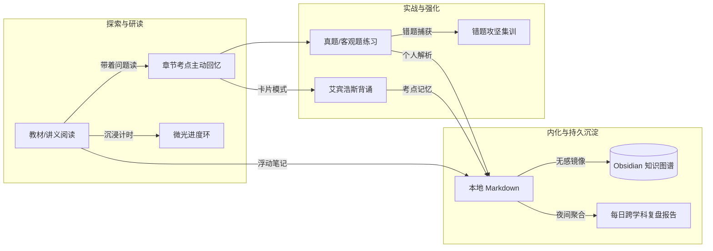

# YuReader

<p align="center">
  <strong>为硬核学习者构建的本地认知作战室 · Local Cognitive Operating Environment</strong>
</p>

<p align="center">
  <em>“读书不是在字里行间漫步，而是带着猎矛在文本丛林中精准突刺。”</em>
</p>

---

## ✦ 缘起：为什么我们厌倦了主流学习工具？

在现代学习场景中，每一个严肃学习者几乎都在经历一种**认知割裂的酷刑**：

- 在 PDF 阅读器里看教材，昏昏欲睡，读完三章脑中依然一片空白；
- 去刷题 App 里刷客观题，答案对了就滑过，做错了解析只有孤立的一两句话，与教材正文完全脱节；
- 打开笔记软件试图总结，变成了机械的“复制 - 粘贴 - 排版”，在知识管理软件里堆积了一堆从未真正内化过的“知识尸体”；
- 旁边放着番茄钟或手机计时器，动辄弹出的数字与震动不断制造焦虑，工具切换的摩擦力吞噬了大半心力。

**YuReader 的诞生，就是为了终结这种碎片化。**

它不是又一个平庸的 Electron 阅读器，也不是又一个套壳题库。它是一套**以书籍为本位、本地优先（Local-First）、严谨典雅的个人认知操作系统**。它将「通读教材」、「带着问题主动回忆」、「真题实战」、「即时错题攻坚」与「本地知识库镜像」熔铸为一体，让深阅读与硬核应试形成严密咬合的飞轮。

---

## ✦ 闪光的小巧思 (Clever Design Nuggets)

抛开繁琐的技术参数，YuReader 真正让人上瘾的，是隐藏在交互深处的各种克制而深思熟虑的微创新：

### 1. 「带着问题读」：把教材直接变成靶场
> *“凭空读书缺乏目的，而名词解释和论述大题，刚好能让你带着刺刀去巡航。”*

- **章节考点自动映射**：系统内部建有一套章节知识图谱映射引擎，将 2,200+ 道高频考题（名解、论述、重点）高保真锚定回每一本官方教材的具体章节。
- **主动回忆（Active Recall）折叠设计**：点击顶部「带着问题读」，抽屉滑出本章考题。这里没有直接剧透的标准答案，只有星级和干文。先在大脑中检索回忆、带着考点研读正文，再展开对比核对——**阅读不再是被动的信息灌输，而是一场主动的侦察与验证**。

### 2. 「徽标微光环 & 静默呼吸点」：零屏幕文字的状态美学
> *“我不希望出现任何多余的文字，尽可能的轻，但又要掌控全局。”*

- **彻底剔除数字噪音**：摒弃传统打卡软件充满压迫感的时间跳字与浮夸圆环，YuReader 将状态指示融进了左上角 40px 的品牌徽标外围——一条 1.5px 极细的同心微光弧线，和一个 6px 的静默微点。
- **自适应任务驱动完成度**：
  - **在教材阅读中**：进度环不记录粗糙的滚动条位置，而是精确映射你当前学科的**教材阅读时长指标**（如医学 2.0h、政治 0.5h、英语 0.5h），随真实阅读以 1 秒为步长实时平滑闭合；
  - **在主页今日中**：映射整日总学时；
  - **在背诵与错题中**：实时感应卡片斩杀率与答题进度。
- **3.5 秒慢呼吸**：计时活跃时，微点以极舒缓的暖色光晕微微呼吸；余光一瞥便能确信系统在陪伴前行，鼠标悬停即浮显详细数据，把纯净和沉浸还给阅读本身。

### 3. 「正文与题库的量子纠缠」：打破切屏地狱
- **完形填空的原位点选**：不再是“上面一段文章、下面翻来翻去找题”。YuReader 将 20 个空位直接无缝融合进正文段落，点击某空，下方仅浮现该空选项，沉浸感如在真实纸面批注。
- **长篇阅读的双栏工作台**：左侧完整原文、右侧全组试题。原文段落与题目选项同屏对照，提交前完全封锁答案解析防剧透；提交后直出原书解析与个人复盘区。
- **主观题盲打与双重对比**：翻译与作文工作台左侧展示材料，右侧提供独立作答区与实时字数提示。只有完成独立构思后，才允许展开权威参考译文与解析。

### 4. 「艾宾浩斯抗遗忘 + 错题斩杀营」
- **重点卡片无缝翻转**：名词解释与简答论述采用类 Anki 的极速卡片流（Flashcards），支持正反面翻转、遮挡填空（Cloze）与重点星标。
- **智能记忆间隔调度**：依据「完全遗忘 / 模糊犹豫 / 熟练掌握」自动排程复习周期。
- **错题二刷攻坚**：每一道做错的客观题都会自动收录进专属错题本，提供独立的“消灭错题”集训模式，直到将错题本彻底清零。

### 5. 「本地优先 · 与 Obsidian 双向呼吸」
- **数据完全主权**：没有云端 SaaS 绑定，没有网络断连的恐慌。所有教材、题库、笔记与学习轨迹均以纯净、开放的 Markdown / JSON 格式安放在本地。
- **Vault 自动镜像**：当检测到本地 Obsidian 知识库时，章节笔记、刷题个人解析、翻译作文练习与每日复盘总结会自动以优雅的目录层级原子镜像写入你的 Obsidian Vault。在 YuReader 里读书做题，在 Obsidian 里编织双链知识图谱。

### 6. 「克制庄重的古典阅读排版」
- 拒绝粗暴套用 Ant Design 或 Bootstrap 带来的“管理后台感”，汲取 Anthropic / Claude 的设计精髓与古典版刻美学。
- 暖色柔和背板（`#f5f4ed`）、精炼细线分割、典雅衬线字体排版，搭配经过深思熟虑的暗黑夜间模式，让屏幕散发出纸质专著的沉静与庄严。

---

## ✦ 认知闭环流架构



---

## ✦ 无限潜力点 (The Horizon & Future)

YuReader 不仅仅是一套为特定考试打造的利器，它验证了一种**全新的个人学习基础设施范式**：

1. **AI 原生学习副驾（AI-Native Sidecar Agent）**：
   - YuReader 的页面上下文以极高保真度结构化暴露。右侧可直接无缝挂载大语言模型（如 Claude 或 Gemini），AI 扮演的不再是虚无缥缈的聊天机器人，而是**坐在你书桌旁的苏格拉底式私教**——随时对你读到的段落提问、按考点评分你的口述录音、为你的主观题逐句批改润色。
2. **专业级领域知识的工业级治理管道**：
   - 包含从扫描版教材 OCR、目录边界识别、专科生僻字符修复（如口腔医学特有字符的清洗），到试题原题/解析的智能拆解，具备将任意硬核学科书籍快速转化为“可阅读、可检索、可练习”交互资产的能力。
3. **终身外脑操作系统**：
   - 当数月的学习轨迹、数千道题目的攻坚心流、数百条深入骨髓的章节笔记汇聚于此，它便演化为你专属的“第二大脑”。所有知识不是散落的书签，而是伴随时间维度生长沉淀的个人认知结晶。

---

## ✦ 快速启动

### 依赖环境
- Python 3.10+
- （可选）现代主流浏览器，推荐 Chrome / Edge

### 启动服务
```powershell
# 1. 运行主服务
python app.py

# 2. 访问控制台
浏览器打开 http://127.0.0.1:8775
```
或直接双击项目根目录下的 **`启动 YuReader.bat`**。

---

<p align="center">
  <strong>YuReader · 把专注留给自己，把知识铸成武器。</strong>
</p>
